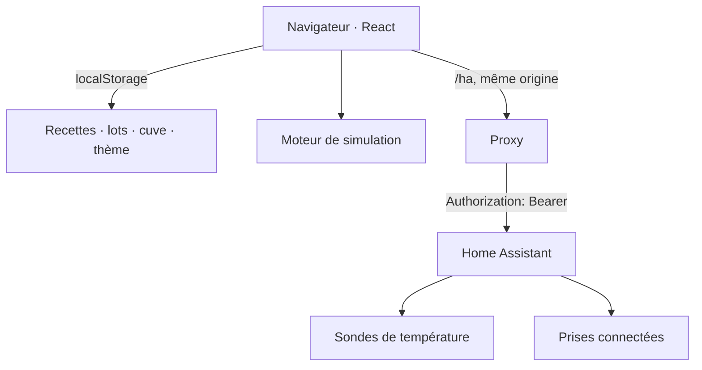

# Architecture

## Vue d'ensemble

L'application est **entièrement côté navigateur**. Il n'y a ni serveur applicatif, ni base de
données, ni routeur : une seule page, trois vues, et deux sources de données.

**Pourquoi ainsi** : les mesures des cinq ferments sont *simulées* — un backend n'aurait rien
à calculer. La seule chose réelle est Home Assistant, qui porte déjà l'authentification, les
appareils et les mesures. Le navigateur n'a donc qu'un travail : afficher et décider.

## Le proxy Home Assistant

Le jeton n'est jamais dans le navigateur. Le navigateur appelle `/ha/...` en **même origine**,
un intermédiaire ajoute l'en-tête d'autorisation et relaie :

| Environnement | Intermédiaire | Source du jeton |
|---|---|---|
| Développement | le serveur de dev (`vite.config.ts`) | `.env.local` |
| Production | nginx (`/etc/nginx/templates/default.conf.template`) | Secret Kubernetes `fermentation-v3-ha` |

C'est aussi ce qui rend la vue Devices inutile à sécuriser : l'API ne l'expose jamais.

## Les couches du code

| Dossier | Rôle | Règle |
|---|---|---|
| `src/config/` | les données : ferments, référentiel d'ingrédients, modèles de cuve | que des données, aucune décision |
| `src/lib/` | la logique pure : formatage, états, régulation, recettes, eau, matériel | ni React, ni DOM |
| `src/hooks/` | l'état persisté : recettes, productions, cuve, thème, flux | **eux seuls** écrivent dans `localStorage` |
| `src/components/` | le rendu | n'écrivent jamais dans le stockage |
| `src/simulation/` | le moteur local | ne connaît ni React ni les recettes |

`src/types.ts` est le **seul point de synchronisation** : un type qui y change fait échouer la
compilation partout où il faut suivre, plutôt que de dériver en silence.

## Le moteur de simulation

- 24 h d'historique, un point toutes les 2 s.
- Par canal : bruit blanc, cycle lent de régulation, perturbations ponctuelles.
- **Graine fixe par ferment** : l'historique est reproductible d'un rechargement à l'autre.
- Une production lancée depuis la bibliothèque devient un ferment comme les autres, à partir
  de son type — le moteur ne connaît pas les recettes.

## Le stockage

Quatre clés `localStorage`, enveloppe versionnée `{ version, <champ>: ... }`, relue
défensivement : une entrée inexploitable est écartée **une à une**, une écriture refusée
(quota, navigation privée) laisse la session continuer.

| Clé | Version | Contenu |
|---|---|---|
| `fermentation4.recipes` | 7 | recettes, appareils liés, volume visé et durée d'ébullition |
| `fermentation4.productions` | 2 | lots lancés |
| `fermentation4.equipment` | 1 | la cuve : évaporation, perte, absorption |
| `fermentation4.theme` | — | thème clair ou sombre |

Les versions montent sans jamais casser l'existant : une recette écrite avant une évolution se
relit sans le champ nouveau, l'absence est un état et non un manque.

## L'asservissement des prises

Seuls les lots qui portent une prise entrent dans la boucle, et il faut **une sonde qui
répond** pour chauffer : sans mesure, les prises sont coupées — une sonde muette ne doit pas
laisser un tapis chauffer sans surveillance (`src/lib/control.ts`).

Le sens de la boucle : **sous la consigne on allume, à la consigne ou au-dessus on éteint**,
et entre les deux on ne touche à rien. Cette bande morte est de **0,3 °C**, la valeur réglée
dans `HEAT_DEAD_BAND` : elle protège le relais du bruit de la sonde, pour une cuve qui oscille
sur trois dixièmes.

À ne pas confondre avec la bande de l'**affichage** (0,1 °C, `src/lib/regulation.ts`), qui ne
décide que de la pastille *Chauffe / Refroidissement / À consigne* — et qu'un lot asservi ne
montre même pas : il affiche la commande réellement envoyée.

## Le calcul d'eau de brassage

Le calcul vit dans `src/lib/water.ts`, les réglages de la cuve dans `src/lib/equipment.ts`, et
les modèles de cuve dans `src/config/equipment.ts`. Le principe, les protocoles de mesure et
les exemples vérifiés sont dans [`eau-de-brassage.md`](eau-de-brassage.md).

## Ce qui a été retiré

Le projet précédent tournait sur un backend Express, InfluxDB et SQLite, avec un
`zigbee2mqtt` et des prototypes HTML. **Tout cela a été supprimé du cluster le 2026-09-14**,
données comprises, et remplacé par cette application. Il en reste des dossiers dans le dépôt
(`backend/`, `zigbee2mqtt/`, `prototype-*.html`) qui ne sont ni construits ni déployés —
voir la fin du [`README`](README.md).
