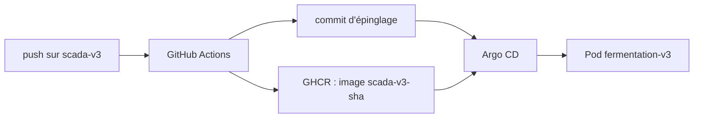

# Déploiement

## Le principe

Une **branche par version** — `scada-v3` pour celle-ci. Le dépôt est la source de vérité :
personne n'applique un manifeste à la main, et Argo CD ramène le cluster à ce que dit le
dépôt dès qu'il s'en écarte.

## La chaîne, de bout en bout



1. **Push** sur `scada-v3`, touchant `src/`, `public/`, `index.html`, `package.json`,
   `vite.config.ts`, `Dockerfile`, `nginx.conf` ou le workflow lui-même.
2. **GitHub Actions** (`.github/workflows/build-frontend.yml`) construit l'image et la pousse
   sur GHCR sous deux étiquettes : `scada-v3` (mobile, pour le dépannage) et
   `scada-v3-<sha>` (**immuable**, c'est celle qu'on déploie).
3. **Le workflow épingle le tag** dans `manifests/frontend.yaml` et pousse ce commit.
   Argo CD ne réagit qu'à un changement de manifeste, pas à une nouvelle image publiée sous
   un tag existant : c'est ce commit qui déclenche le déploiement.
4. **Argo CD** applique (`Application` `fermentation-v3`, `path: manifests`,
   `targetRevision: scada-v3`), le pod redémarre sur la nouvelle image.

## Les manifestes

| Fichier | Contenu |
|---|---|
| `manifests/frontend.yaml` | Deployment + Service. `envFrom` le ConfigMap, `HASS_TOKEN` d'un Secret, sondes de disponibilité, ressources, annotation `restartedAt` |
| `manifests/configmap.yaml` | `HASS_URL` — l'adresse de Home Assistant n'est pas un secret : elle se règle par manifeste, sans reconstruire d'image |
| `manifests/ingress.yaml` | l'hôte `ferment.myfermentlab` |
| `argocd/application-scada-v3.yaml` | l'Application Argo CD |

Deux accès, parce qu'ils ne servent pas à la même chose :

- **NodePort 30087** — `http://192.168.1.51:30087`, joignable par l'adresse IP, sans DNS.
- **Ingress** — `http://ferment.myfermentlab`, à condition que ton DNS local (ou `/etc/hosts`)
  résolve le nom vers `192.168.1.51`. Un hôte dédié plutôt qu'un sous-chemin : l'application
  sert ses fichiers sous `/assets/` et appelle `/ha/` en absolu.

## Le jeton Home Assistant

Le jeton n'est pas dans le dépôt, ni dans le JavaScript servi : il vit dans un Secret, et
**nginx l'injecte au démarrage du conteneur**. Un pod ne prend donc un nouveau jeton qu'en
redémarrant.

```bash
read -rs TOKEN          # colle le jeton, il ne s'affiche pas
printf %s "$TOKEN" | kubectl -n default create secret generic fermentation-v3-ha \
  --from-file=HASS_TOKEN=/dev/stdin --dry-run=client -o yaml | kubectl apply -f -
unset TOKEN
```

**Le piège** : un jeton suivi d'un retour à la ligne casse l'en-tête et nginx répond 401.
D'où `printf %s` — jamais `echo`.

Puis, pour que le pod le prenne, **modifier l'annotation `kubectl.kubernetes.io/restartedAt`
dans `manifests/frontend.yaml` et pousser**. Un `kubectl rollout restart` ne sert à rien :
Argo CD remet aussitôt le modèle du dépôt et le pod garde son ancien environnement.

## Vérifier

```bash
kubectl -n argocd get application fermentation-v3      # Synced · Healthy
kubectl -n default get deploy,pods
kubectl -n default get deploy fermentation-v3 -o jsonpath={.spec.template.spec.containers[0].image}

# 200 = le proxy et le jeton fonctionnent ; 401 = Secret absent ou jeton invalide
curl -s -o /dev/null -w '%{http_code}\n' http://192.168.1.51:30087/ha/api/
```

Depuis la vue Devices, la même information se lit à l'écran : les appareils s'y listent, ou
l'erreur de lecture s'y affiche.

## Revenir en arrière

Le tag déployé est **immuable** : revenir sur le commit d'épinglage qui portait l'image
précédente suffit. Argo CD redéploie, sans reconstruction.

## Ce qui n'existe plus

`backend`, `influxdb`, `zigbee2mqtt` et le namespace `vtt` ont été **supprimés le
2026-09-14**, volumes et données compris. Il reste une sauvegarde des manifestes dans
`~/backup-k3s-20260914/` sur le serveur, purgée de ses secrets.

## Diagnostic

| Symptôme | Cause probable |
|---|---|
| La vue Devices affiche 401 | Secret absent, ou `restartedAt` non modifié depuis son changement |
| Le pod garde son ancien environnement | On a redémarré à la main au lieu de changer le manifeste |
| Argo CD reste `OutOfSync` | Un manifeste a été édité directement sur le cluster |
| L'adresse IP ne répond pas, le nom d'hôte oui | Le Service a perdu son NodePort, ou le nom n'est pas résolu |
