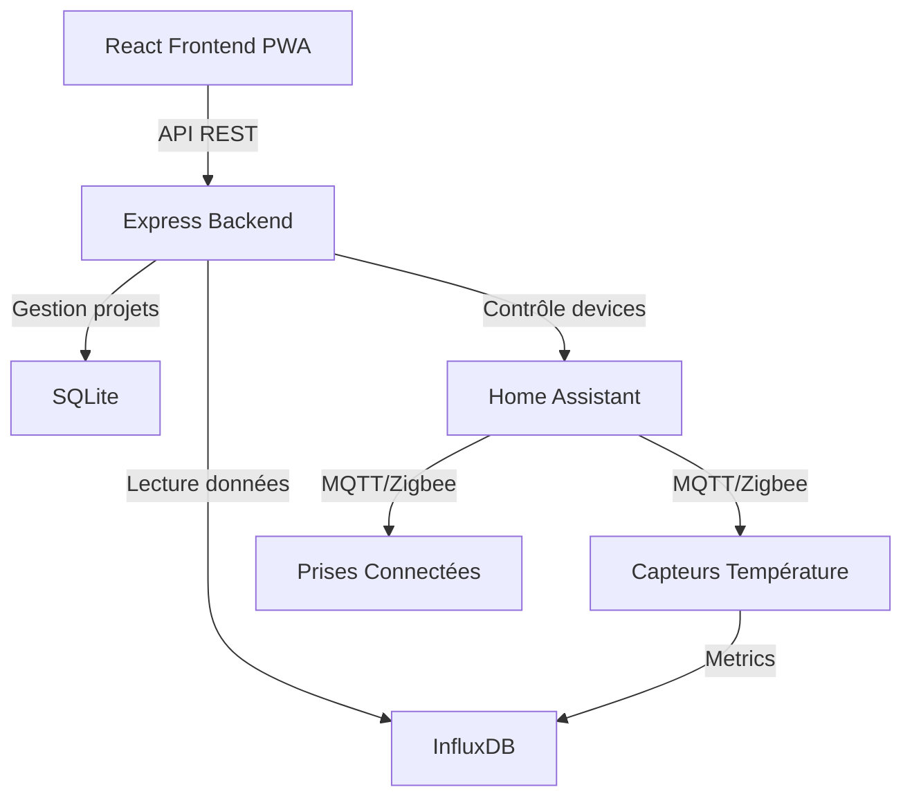

<div align="center">

# 🧪 MyFermentLab

### Système de Monitoring Intelligent pour Fermentations Artisanales

[](https://opensource.org/licenses/MIT)
[](https://www.typescriptlang.org/)
[](https://reactjs.org/)
[](https://nodejs.org/)
[](https://www.docker.com/)

*Contrôlez et surveillez vos fermentations de bière, vin et saké avec précision et simplicité*

[Fonctionnalités](#-fonctionnalités) • [Installation](#-installation) • [Documentation](#-configuration) • [Architecture](#-architecture)

</div>

---

## 📖 À propos

**MyFermentLab** est une application web moderne et complète pour le monitoring et le contrôle automatique de vos fermentations artisanales. Conçue pour les brasseurs et vignerons amateurs, elle offre un suivi précis de la température et de la densité, avec un contrôle intelligent du chauffage.

### 🎯 Cas d'usage

- 🍺 **Brassage de bière** : Contrôle précis de la température et suivi de la densité pour calculer l'ABV
- 🍷 **Vinification** : Surveillance des températures de fermentation primaire et secondaire
- 🍶 **Production de saké** : Contrôle des températures basses pour fermentation traditionnelle
- 📊 **Suivi historique** : Archivage et comparaison de vos brassins passés

## ✨ Fonctionnalités

### 🌡️ Monitoring en Temps Réel

- **Température live** depuis capteurs Zigbee via Home Assistant
- **Graphiques interactifs** avec zoom et sélection de période (1h à 30j)
- **Alertes visuelles** pour température hors plage
- **Interface responsive** optimisée mobile avec support PWA

### 🎛️ Contrôle Automatique

| Mode | Description |
|------|-------------|
| **Auto** | Contrôle PID intelligent basé sur température cible ±0.5°C |
| **Manuel** | Contrôle direct ON/OFF du tapis chauffant |

### 📊 Suivi de Fermentation

- **Enregistrement de densité** (SG) avec calcul automatique ABV
- **Historique complet** de température et densité
- **Notes et observations** pour chaque projet
- **Multi-projets** avec gestion des ressources (capteurs, prises)

### 🔐 Gestion des Utilisateurs

- **Mode Admin** : Contrôle complet (création, modification, suppression)
- **Mode Lecture** : Consultation uniquement (idéal pour partager l'accès)
- **Authentification sécurisée** avec stockage de session

### 📱 Progressive Web App (PWA)

- **Installation sur mobile** : Ajoutez l'app à votre écran d'accueil
- **Mode hors-ligne** : Consultez les données même sans connexion
- **Notifications push** (à venir) : Alertes de température

## 🏗 Architecture



### 🛠 Stack Technique

<table>
<tr>
<td width="50%">

**Frontend**
- ⚛️ React 18 + TypeScript
- 📊 Recharts (graphiques)
- 🎨 CSS3 avec design moderne
- ⚡ Vite (build ultra-rapide)
- 📱 PWA avec service workers

</td>
<td width="50%">

**Backend**
- 🟢 Node.js 20 + Express
- 📘 TypeScript
- 💾 SQLite (projets)
- 📈 InfluxDB client (séries temporelles)
- 🏠 Home Assistant API

</td>
</tr>
<tr>
<td colspan="2">

**Infrastructure**
- 🐳 Docker & Docker Compose
- ☸️ Kubernetes (K3s)
- 🔄 ArgoCD (GitOps)
- 🚀 GitHub Actions (CI/CD)
- 🌐 Nginx (reverse proxy)

</td>
</tr>
</table>

## 📦 Prérequis

### Matériel Requis

- **Capteurs de température** Zigbee (ex: Aqara, Sonoff)
- **Prises connectées** Zigbee ou WiFi (ex: Sonoff S31, Aqara)
- **Coordinateur Zigbee** (ConBee II, Sonoff ZBDongle, etc.)
- **Tapis chauffant** pour fermentation
- **Serveur** : Raspberry Pi 4+ ou NUC (pour Home Assistant + MyFermentLab)

### Logiciels Requis

| Environnement | Versions |
|--------------|----------|
| Node.js | 20.x ou supérieur |
| npm/yarn | 9.x ou supérieur |
| Docker | 24.x (optionnel) |
| Home Assistant | 2024.x |
| InfluxDB | 2.x |

## 🚀 Installation

### Méthode 1 : Installation Rapide (Docker Compose)

```bash
# Cloner le repository
git clone https://github.com/TimBenedet/MyFermentLab.git
cd MyFermentLab

# Configurer les variables d'environnement
cp backend/.env.example backend/.env
nano backend/.env  # Éditer avec vos paramètres

# Lancer avec Docker Compose
docker-compose up -d

# Accéder à l'application
open http://localhost:3000
```

### Méthode 2 : Installation Développement

<details>
<summary>📖 Afficher les instructions détaillées</summary>

#### 1. Cloner et Installer

```bash
git clone https://github.com/TimBenedet/MyFermentLab.git
cd MyFermentLab

# Frontend
npm install

# Backend
cd backend
npm install
cd ..
```

#### 2. Configurer Backend

Créer `backend/.env` :

```env
# InfluxDB Configuration
INFLUX_URL=http://localhost:8086
INFLUX_TOKEN=your-super-secret-token-here
INFLUX_ORG=fermentation
INFLUX_BUCKET=sensors

# Home Assistant
HOME_ASSISTANT_URL=http://192.168.1.100:8123
HOME_ASSISTANT_TOKEN=your-ha-long-lived-token

# Application
PORT=3001
POLL_INTERVAL=30000
DB_PATH=./data/fermentation.db

# Authentication
ADMIN_PASSWORD=your-secure-password
```

#### 3. Générer les Icônes PWA

```bash
npm run generate-icons
```

#### 4. Lancer en Mode Dev

**Terminal 1 - Frontend :**
```bash
npm run dev
# ➜ Local: http://localhost:5173
```

**Terminal 2 - Backend :**
```bash
cd backend
npm run dev
# ➜ API: http://localhost:3001
```

#### 5. Accéder à l'App

Ouvrir [http://localhost:5173](http://localhost:5173)

</details>

### Méthode 3 : Déploiement Kubernetes

<details>
<summary>☸️ Afficher le guide Kubernetes</summary>

#### Prérequis
- Cluster K3s configuré
- `kubectl` installé et configuré
- ArgoCD installé (optionnel mais recommandé)

#### Installation Manuelle

```bash
# Créer le namespace
kubectl create namespace fermentation

# Déployer InfluxDB
kubectl apply -f manifests/influxdb.yaml

# Déployer le backend
kubectl apply -f manifests/backend.yaml

# Déployer le frontend
kubectl apply -f manifests/frontend.yaml

# Configurer l'ingress
kubectl apply -f manifests/ingress.yaml

# Vérifier le déploiement
kubectl get pods -n fermentation
```

#### Avec ArgoCD (GitOps)

Créer `argocd-app.yaml` :

```yaml
apiVersion: argoproj.io/v1alpha1
kind: Application
metadata:
  name: myfermentlab
  namespace: argocd
spec:
  project: default
  source:
    repoURL: https://github.com/TimBenedet/MyFermentLab.git
    targetRevision: main
    path: manifests
  destination:
    server: https://kubernetes.default.svc
    namespace: fermentation
  syncPolicy:
    automated:
      prune: true
      selfHeal: true
    syncOptions:
      - CreateNamespace=true
```

Appliquer :
```bash
kubectl apply -f argocd-app.yaml
```

</details>

## ⚙️ Configuration

### 🏠 Configuration Home Assistant

<details>
<summary>📋 Exemple de configuration YAML</summary>

**1. Intégration InfluxDB** (`configuration.yaml`)

```yaml
influxdb:
  api_version: 2
  host: localhost
  port: 8086
  token: !secret influxdb_token
  organization: fermentation
  bucket: sensors
  include:
    entities:
      - sensor.temperature_fermentation_beer
      - sensor.temperature_fermentation_wine
      - switch.heating_mat_beer
      - switch.heating_mat_wine
```

**2. Capteurs Zigbee via MQTT**

```yaml
mqtt:
  sensor:
    - name: "Temperature Fermentation Beer"
      state_topic: "zigbee2mqtt/temperature_sensor_beer"
      unit_of_measurement: "°C"
      value_template: "{{ value_json.temperature }}"
      device_class: temperature

  switch:
    - name: "Heating Mat Beer"
      state_topic: "zigbee2mqtt/smart_plug_beer"
      command_topic: "zigbee2mqtt/smart_plug_beer/set"
      payload_on: '{"state": "ON"}'
      payload_off: '{"state": "OFF"}'
      state_on: "ON"
      state_off: "OFF"
      value_template: "{{ value_json.state }}"
```

**3. Créer un Long-Lived Access Token**

1. Aller dans votre profil Home Assistant
2. Scroll vers le bas jusqu'à "Long-Lived Access Tokens"
3. Cliquer "Create Token"
4. Nommer le token "MyFermentLab"
5. Copier le token dans votre `.env` backend

</details>

### 📊 Configuration InfluxDB

<details>
<summary>🔧 Étapes de configuration</summary>

**Via l'Interface Web** (http://localhost:8086)

1. **Créer une organisation**
   - Organization Name: `fermentation`

2. **Créer un bucket**
   - Bucket Name: `sensors`
   - Retention: Infini (ou selon vos besoins)

3. **Générer un token**
   - API Tokens → Generate API Token → Read/Write Token
   - Sélectionner les buckets: `sensors`
   - Copier le token généré

**Via CLI**

```bash
# Créer l'organisation
influx org create -n fermentation

# Créer le bucket
influx bucket create -n sensors -o fermentation -r 0

# Créer le token
influx auth create \
  --org fermentation \
  --read-bucket sensors \
  --write-bucket sensors \
  --description "MyFermentLab Token"
```

</details>

## 📱 Utilisation

### Créer votre Premier Projet

1. **Lancer l'application** et se connecter en mode Admin
2. Cliquer sur **"+ Nouveau Projet"**
3. Remplir le formulaire :

| Champ | Description | Exemple |
|-------|-------------|---------|
| Nom | Nom de votre brassin | "IPA Cascade 2024" |
| Type | Bière / Vin / Saké | Bière |
| Capteur | Capteur de température HA | sensor.temp_ferment_beer |
| Prise | Prise connectée HA | switch.heating_mat |
| Température | Température cible | 20°C |
| Mode | Auto / Manuel | Auto |

4. **Sauvegarder** → Le monitoring démarre automatiquement!

### Interface de Monitoring

```
┌─────────────────────────────────────────────────────┐
│  🏠 Accueil          📊 Projets          👤 Admin   │
├─────────────────────────────────────────────────────┤
│                                                     │
│  🍺 IPA Cascade 2024                    [Actif]    │
│  ┌────────────────────────────┐                    │
│  │  🌡️ Température : 20.2°C   │  Cible: 20°C      │
│  │  🔌 Tapis : ● ON           │  Mode: Auto       │
│  │  📈 Densité : 1.015        │  ABV: 4.5%        │
│  └────────────────────────────┘                    │
│                                                     │
│  📊 Graphique (dernières 24h)                      │
│  ┌────────────────────────────────────────────┐   │
│  │        🌡️                                   │   │
│  │    22°├───╮                                │   │
│  │    21°│   ╰──╮                             │   │
│  │    20°│      ╰────────                     │   │
│  │    19°│                                    │   │
│  └────────────────────────────────────────────┘   │
│  [1h] [6h] [24h] [7j] [30j] [Tout]                │
│                                                     │
│  💧 Mesures de Densité                             │
│  01/12 - 1.050 → 01/05 - 1.015 → ABV: 4.5%       │
│  [+ Ajouter une mesure]                            │
└─────────────────────────────────────────────────────┘
```

### Ajouter des Mesures de Densité (Bière)

1. Prélever un échantillon et mesurer avec un densimètre
2. Dans MyFermentLab : **"+ Ajouter une mesure"**
3. Entrer la valeur (ex: `1.015`)
4. L'ABV est calculé automatiquement : `ABV = (OG - FG) × 131.25`

### Mode Lecture Seule

Parfait pour partager l'accès sans risque de modification :

1. Se connecter en **Mode Lecture**
2. Visualiser tous les projets et graphiques
3. Aucune action de modification disponible

## 🔄 API Backend

### Endpoints Principaux

| Méthode | Endpoint | Description |
|---------|----------|-------------|
| `GET` | `/api/projects` | Liste tous les projets |
| `POST` | `/api/projects` | Créer un projet |
| `GET` | `/api/projects/:id` | Détails + historique |
| `PUT` | `/api/projects/:id/target-temperature` | Modifier température |
| `PUT` | `/api/projects/:id/outlet` | Toggle prise |
| `PUT` | `/api/projects/:id/control-mode` | Changer mode |
| `PUT` | `/api/projects/:id/archive` | Archiver |
| `DELETE` | `/api/projects/:id` | Supprimer |
| `POST` | `/api/projects/:id/density` | Ajouter densité |
| `GET` | `/api/devices` | Liste devices HA |

<details>
<summary>📖 Voir exemples de requêtes</summary>

**Créer un projet**

```bash
curl -X POST http://localhost:3001/api/projects \
  -H "Content-Type: application/json" \
  -d '{
    "name": "IPA Cascade 2024",
    "type": "beer",
    "temperatureSensor": "sensor.temp_beer",
    "outletSwitch": "switch.heating_mat",
    "targetTemperature": 20,
    "controlMode": "auto",
    "initialDensity": 1.050
  }'
```

**Ajouter une mesure de densité**

```bash
curl -X POST http://localhost:3001/api/projects/1/density \
  -H "Content-Type: application/json" \
  -d '{
    "density": 1.015,
    "timestamp": "2024-12-01T10:30:00Z"
  }'
```

</details>

## 🛠 Développement

### Structure du Projet

```
MyFermentLab/
├── 📁 src/                      # Frontend React
│   ├── 📄 App.tsx              # Composant principal
│   ├── 📄 App.css              # Styles globaux
│   ├── 📁 contexts/
│   │   └── AuthContext.tsx     # Gestion authentification
│   ├── 📁 components/          # Composants (à venir)
│   └── 📄 main.tsx             # Point d'entrée
│
├── 📁 backend/                  # Backend Express
│   ├── 📁 src/
│   │   ├── 📄 index.ts         # Serveur Express
│   │   ├── 📁 routes/          # Routes API (à venir)
│   │   └── 📁 services/        # Services métier (à venir)
│   └── 📁 data/                # Base SQLite
│
├── 📁 public/                   # Assets statiques
│   ├── 🖼️ icon.png             # Logo source
│   ├── 🖼️ icon-192.png         # PWA icon 192x192
│   ├── 🖼️ icon-512.png         # PWA icon 512x512
│   ├── 🖼️ apple-touch-icon.png # iOS icon 180x180
│   └── 📄 manifest.json        # PWA manifest
│
├── 📁 scripts/                  # Scripts utilitaires
│   └── 📄 generate-icons.js    # Génération icônes PWA
│
├── 📁 manifests/                # Kubernetes YAML
│   ├── 📄 influxdb.yaml
│   ├── 📄 backend.yaml
│   ├── 📄 frontend.yaml
│   └── 📄 ingress.yaml
│
├── 📁 .github/workflows/        # GitHub Actions
│   ├── 📄 build-frontend.yml
│   └── 📄 build-backend.yml
│
├── 🐳 Dockerfile               # Multi-stage Docker build
├── 🐳 docker-compose.yml       # Stack complète
├── 📄 package.json             # Dépendances frontend
└── 📖 README.md                # Ce fichier
```

### Commandes Utiles

```bash
# Développement
npm run dev                    # Frontend (Vite)
cd backend && npm run dev      # Backend (Nodemon)

# Build Production
npm run build                  # Frontend → dist/
cd backend && npm run build    # Backend → dist/

# Linting
npm run lint                   # ESLint

# Génération PWA
npm run generate-icons         # Créer icônes de toutes tailles

# Docker
docker-compose up -d           # Lancer la stack
docker-compose logs -f         # Voir les logs
docker-compose down            # Arrêter

# Kubernetes
kubectl apply -f manifests/    # Déployer tout
kubectl logs -f deployment/backend  # Logs backend
kubectl port-forward svc/frontend 8080:80  # Accès local
```

### Guidelines de Contribution

1. **Code Style**
   - Utiliser TypeScript strict
   - Suivre les conventions ESLint
   - Commenter le code complexe

2. **Commits**
   - Format: `type(scope): message`
   - Types: `feat`, `fix`, `docs`, `style`, `refactor`, `test`
   - Exemple: `feat(frontend): add density chart`

3. **Pull Requests**
   - Fork le projet
   - Créer une branche feature: `git checkout -b feat/new-feature`
   - Commit: `git commit -m 'feat: add new feature'`
   - Push: `git push origin feat/new-feature`
   - Ouvrir une PR avec description détaillée

## 🐛 Dépannage

<details>
<summary>❌ Erreur de connexion InfluxDB</summary>

**Symptôme** : `Error: Failed to connect to InfluxDB`

**Solutions** :
1. Vérifier qu'InfluxDB est démarré : `docker ps | grep influx`
2. Tester la connexion : `curl http://localhost:8086/health`
3. Vérifier le token dans `.env`
4. Vérifier que l'organisation et le bucket existent

</details>

<details>
<summary>❌ Devices Home Assistant non trouvés</summary>

**Symptôme** : Liste vide dans le sélecteur de devices

**Solutions** :
1. Vérifier le token HA dans `.env`
2. Tester l'API : `curl -H "Authorization: Bearer YOUR_TOKEN" http://HA_URL:8123/api/states`
3. Vérifier que les entities existent dans HA
4. Redémarrer le backend

</details>

<details>
<summary>❌ PWA ne s'installe pas sur iPhone</summary>

**Symptôme** : Option "Ajouter à l'écran d'accueil" non disponible

**Solutions** :
1. Utiliser Safari (pas Chrome ou Firefox)
2. Vider le cache Safari
3. Recharger la page
4. Vérifier que le manifest.json est accessible : `/manifest.json`

</details>

## 📊 Roadmap

### Version 1.1 (Q1 2025)
- [ ] Notifications push pour alertes température
- [ ] Export CSV/PDF des données
- [ ] Graphiques de densité avec courbe de prédiction
- [ ] Support multi-langues (EN, FR)

### Version 1.2 (Q2 2025)
- [ ] Mode sombre
- [ ] Recettes de fermentation (bibliothèque)
- [ ] Calcul automatique des ingrédients
- [ ] Intégration Brewfather API

### Version 2.0 (Q3 2025)
- [ ] Application mobile native (React Native)
- [ ] Support caméra pour notes visuelles
- [ ] IA pour prédiction de fin de fermentation
- [ ] Partage social des brassins

## 🤝 Contribution

Les contributions sont les bienvenues et appréciées ! Voici comment participer :

### Types de Contributions

- 🐛 **Bug reports** : Ouvrir une [issue](https://github.com/TimBenedet/MyFermentLab/issues)
- ✨ **Feature requests** : Proposer de nouvelles fonctionnalités
- 📖 **Documentation** : Améliorer ce README ou ajouter des guides
- 💻 **Code** : Corriger des bugs ou ajouter des features
- 🌍 **Traductions** : Ajouter de nouvelles langues

### Processus

1. Fork le projet
2. Créer une branche (`git checkout -b feat/amazing-feature`)
3. Commit (`git commit -m 'feat: add amazing feature'`)
4. Push (`git push origin feat/amazing-feature`)
5. Ouvrir une Pull Request

## 📄 Licence

Ce projet est sous licence **MIT**. Voir le fichier [LICENSE](LICENSE) pour plus de détails.

Vous êtes libre de :
- ✅ Utiliser commercialement
- ✅ Modifier le code
- ✅ Distribuer
- ✅ Utiliser en privé

Sous condition de :
- 📝 Inclure la licence et le copyright
- 📝 Indiquer les changements majeurs

## 👤 Auteur

**Timothée Benedet**

- 🐙 GitHub: [@TimBenedet](https://github.com/TimBenedet)
- 📧 Email: [timothee.benedet@protonmail.com](mailto:timothee.benedet@protonmail.com)
- 🌐 Projet: [MyFermentLab](https://github.com/TimBenedet/MyFermentLab)

## 🙏 Remerciements

Un grand merci aux projets open-source qui rendent MyFermentLab possible :

- [**Home Assistant**](https://www.home-assistant.io/) - Pour l'intégration domotique complète
- [**InfluxDB**](https://www.influxdata.com/) - Pour le stockage performant des séries temporelles
- [**React**](https://reactjs.org/) - Pour le framework frontend moderne
- [**Recharts**](https://recharts.org/) - Pour les graphiques interactifs
- [**Express**](https://expressjs.com/) - Pour le backend Node.js léger
- [**Sharp**](https://sharp.pixelplumbing.com/) - Pour le traitement d'images

Et à toute la communauté homebrew pour l'inspiration et les retours !

---

<div align="center">

**Fait avec ❤️ par des passionnés, pour des passionnés**

Si ce projet vous a aidé, pensez à lui donner une ⭐ !

[⬆ Retour en haut](#-myfermentlab)

</div>
